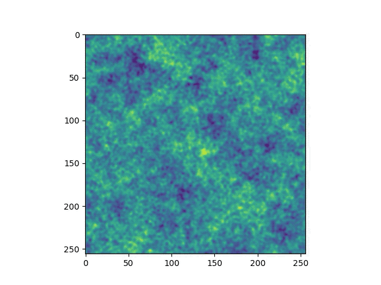
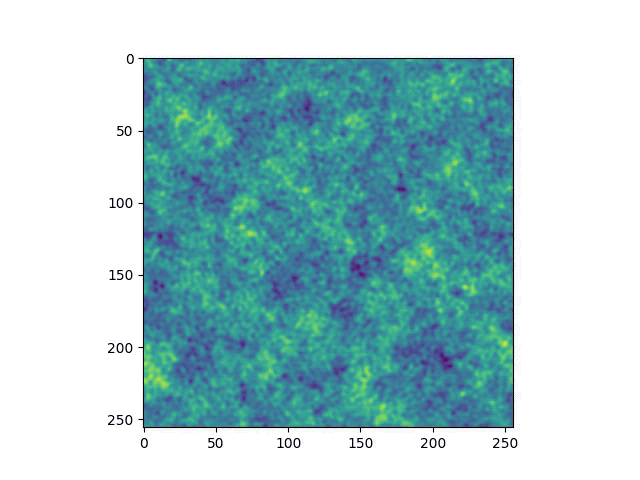

# sla-planet-sim
Simulating the birth of planets using semi-Lagrangian advection and spectral methods.

Based on the research and code contained in 
SIMULATING THE BIRTH OF PLANETS: A SPECTRAL SEMI-LAGRANGIAN HYDRODYNAMIC APPROACH,
a Master's thesis by Wendy Crumrine. Code ported to C from MATLAB for parallelization.

[Introduction](#introduction) •
[Getting started](#getting-started) •
[Installation](#installation) •
[Parallelization](#parallelization) •
[Profile](#profile) •
[TODOs](#todos) 


## Introduction
Planetary formation takes place in a disc of dust and gas rotating around a star.  How planets grow from meter-sized boulders to kilometer-sized planetessimals is still a mystery, as our current models suggest that drag forces within the gas should cause these relatively small bodies to spiral into the star.  

In this project we address the so-called "meter-sized gap problem" by modeling gas and dust as fluids, using a combination of Eulerian and Lagrangian dynamics.  A key component to our approach is quantifying the vorticity of the gas and dust at every point in our sample space.  The underlying model includes five PDE's which are solved using spectral methods.  

The original MATLAB code does not include a background shear factor, and only simulates an irrotational disk of dust and gas.  Our port adds shear to the model (see images below).  

||
|:--:| 
| Model generated by original MATLAB code.  No shear is present, and the disc is irrotational |

||
|:--:| 
| Current simulation using C port adding background shear. |


## Installation
**CAVEAT COMPILER** : This implementation currently has a bad memory leak (easy fix when time allows).

The code requires installation of fftw3 (Fastest Fourier Transform in the West) for FFTs and gsl (GNU scientific library) for interpolation.   It can be compiled within the `c` directory using `gcc -o sla sla.c fft.c -lfftw3 -lgsl -lm`.

To set the box size and number of time steps, adjust values of NX, NY, and NT in the macro definitions in `sla.h`.

The compiled program currently prints out a line of NX x NY floating points representing the grids value of rho (dust density) in row-major order.


## Parallelization
We are exploring the use of FFTW3's native MPI interface to provide parallelization.   The folder `mpi` contains a test program `fftw_mpi_example.c` which parallelizes a single 2D transform of a 256 x 256 grid (time domain -> frequency domain) using the manager/worker paradigm.  It can be compiled using `mpicc -o fftw_mpi_example fftw_mpi_example.c -lmpi -lfftw3 -lfftw3_mpi -lm`.  

Compiling on the Discovery cluster requires loading the relevant packages first:  
```
module load gcc/8.3.0 openmpi/4.0.2 fftw/3.3.8-dp
```
For this toy program, the speed up has been negligible.  The the execution time for a single transform takes approximately 2.0e-02 seconds, using 1, 2, 4 or 8 cores.  We need to explore how effective MPI will be once we integrate it into the main program.

Besides FFTs, the next targets for parallelization are the interpolations being performed by `gsl` and the basic linear algebra operations utilized by the program.

## Profile
(Coming soon)

## TODOs
*  Fix memory leak.
*  Profile code.
*  Parallelize DFTs and interpolations.
*  Install on CARC discovery cluster
*  Explain discrepancies between c port model and MATLAB model.
